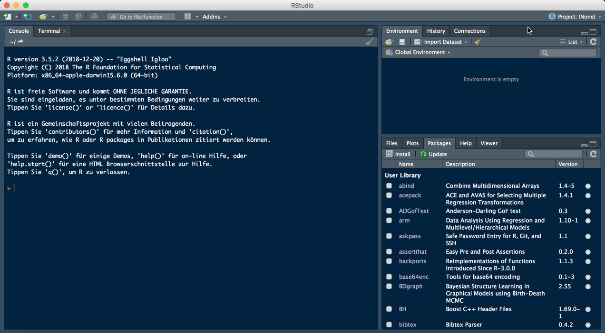
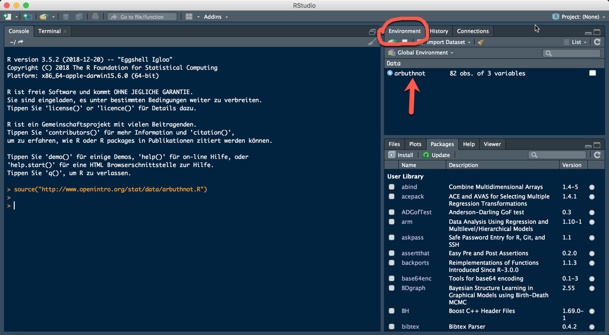
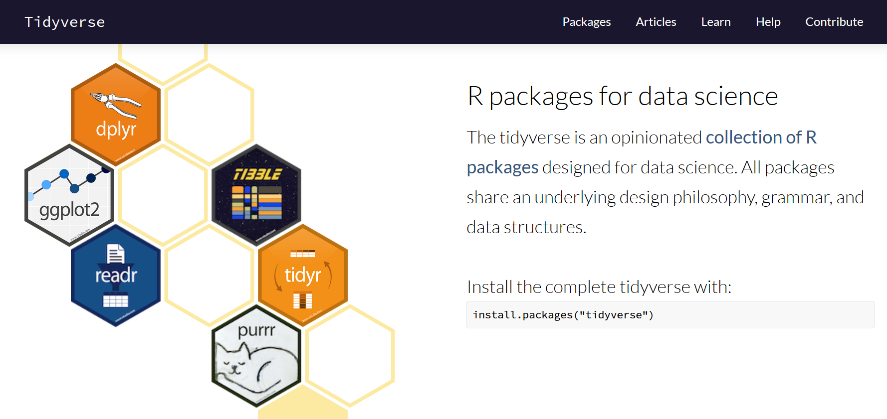

```{r setup, include=FALSE}
library(learnr)
library(tidyverse)
knitr::opts_chunk$set(exercise.completion = FALSE)

knitr::opts_chunk$set(error = TRUE)

```

## Intro

The goal of this lab is to introduce you to R and RStudio, which you'll be using
throughout the course both to learn the statistical concepts discussed in the 
texbook and also to analyze real data and come to informed conclusions.  To 
straighten out which is which: R is the name of the programming language itself 
and RStudio is a convenient interface.

As the labs progress, you are encouraged to explore beyond what the labs dictate;
a willingness to experiment will make you a much better programmer.  Before we 
get to that stage, however, you need to build some basic fluency in R.  Today we
begin with the fundamental building blocks of R and RStudio: the interface, 
reading in data, and basic commands.


```{r, echo=FALSE}

```


The panel in the upper right contains your *workspace* as well as a history of 
the commands that you've previously entered.  Any plots that you generate will 
show up in the panel in the lower right corner.

The panel on the left is where the action happens.  It's called the *console*. 
Everytime you launch RStudio, it will have the same text at the top of the 
console telling you the version of R that you're running.  Below that information
is the *prompt*.  As its name suggests, this prompt is really a request, a 
request for a command.  Initially, interacting with R is all about typing commands
and interpreting the output. These commands and their syntax have evolved over
decades (literally) and now provide what many users feel is a fairly natural way
to access data and organize, describe, and invoke statistical computations.

To get you started, enter the following command at the R prompt (i.e. right after
`>` on the console).  You can either type it in manually or copy and paste it
from this document.

```{r load-abrbuthnot-data}
source("http://www.openintro.org/stat/data/arbuthnot.R")
```

This command instructs R to access the OpenIntro website and fetch some data: 
the Arbuthnot baptism counts for boys and girls. You should see that the 
workspace area in the upper righthand corner of the RStudio window now lists a 
data set called `arbuthnot` that has 82 observations on 3 variables. As you 
interact with R, you will create a series of objects. Sometimes you load them as
we have done here, and sometimes you create them yourself as the byproduct of a 
computation or some analysis you have performed. Note that because you are 
accessing data from the web, this command (and the entire assignment) will work 
in a computer lab, in the library, or in your dorm room; anywhere you have 
access to the Internet.


## The Data: Dr. Arbuthnot's Baptism Records


The Arbuthnot data set refers to Dr. John Arbuthnot, an 18<sup>th</sup> century 
physician, writer, and mathematician.  He was interested in the ratio of newborn
boys to newborn girls, so he gathered the baptism records for children born in
London for every year from 1629 to 1710.  We can take a look at the data by 
typing its name into the console.

```{r view-data, eval=TRUE}
arbuthnot
```


What you should see are four columns of numbers, each row representing a 
different year: the first entry in each row is simply the row number (an index 
we can use to access the data from individual years if we want), the second is 
the year, and the third and fourth are the numbers of boys and girls baptized 
that year, respectively. Use the scrollbar on the right side of the console 
window to examine the complete data set.

Note that the row numbers in the first column are not part of Arbuthnot's data. 
R adds them as part of its printout to help you make visual comparisons. You can
think of them as the index that you see on the left side of a spreadsheet. In 
fact, the comparison to a spreadsheet will generally be helpful. R has stored 
Arbuthnot's data in a kind of spreadsheet or table called a *data frame*.

You can see the dimensions of this data frame by typing:

```{r dim-data, eval=TRUE}
dim(arbuthnot)
```

This command should output `[1] 82 3`, indicating that there are 82 rows and 3 
columns (we'll get to what the `[1]` means in a bit), just as it says next to 
the object in your workspace. You can see the names of these columns (or 
variables) by typing:

```{r names-data, eval=TRUE}
names(arbuthnot)
```

You should see that the data frame contains the columns `year`,  `boys`, and 
`girls`. At this point, you might notice that many of the commands in R look a 
lot like functions from math class; that is, invoking R commands means supplying
a function with some number of arguments. The `dim` and `names` commands, for 
example, each took a single argument, the name of a data frame. 

One advantage of RStudio is that it comes with a built-in data viewer. Click on
the name `arbuthnot` in the *Environment* pane (upper right window) that lists 
the objects in your workspace.

```{r, echo=FALSE}

```


This will bring up an alternative display of the 
data set in the *Data Viewer* (upper left window). You can close the data viewer
by clicking on the *x* in the upper lefthand corner.

### Some Exploration

Let's start to examine the data a little more closely. We can access the data in
a single column of a data frame separately using a command like

```{r view-boys}
arbuthnot$boys
```

This command shows the number of boys baptized each year.

#### Exercise

What command would you use to extract just the counts of girls baptized? Try it!

```{r view-girls-setup}

source("http://www.openintro.org/stat/data/present.R")

```


```{r view-girls, exercise = TRUE}

```

```{r view-girls-solution}
arbuthnot$girls
```

Notice that the way R has printed these data is different. When we looked at the
complete data frame, we saw 82 rows, one on each line of the display. These data
are no longer structured in a table with other variables, so they are displayed 
one right after another. Objects that print out in this way are called *vectors*;
they represent a set of numbers. R has added numbers in [brackets] along the 
left side of the printout to indicate locations within the vector. For example,
`5218` follows `[1]`, indicating that `5218` is the first entry in the vector. 
And if `[43]` starts a line, then that would mean the first number on that line
would represent the 43<sup>rd</sup> entry in the vector.

R has some powerful functions for making graphics. In this course we will not use the base R graphics functions. Instead we will work with the `ggplot2` package, which is part of the tidyverse

```{r, echo=FALSE}

```

The tidyverse is a collection of packages, but you can install it like any other package by running the command

```{r tidyverse, eval=FALSE}
install.packages("tidyverse")
```

After loading the package

```{r tidyverse-load}
library(tidyverse)
```

we can create a simple scatterplot of the number of girls baptized per year with the command

```{r plot-girls-vs-year}
ggplot(data = arbuthnot, mapping = aes(x = year, y = girls)) + geom_point()
```

The command above consists of two parts. `ggplot()` initalies the graphic and sets some global aesthetics with `aes()`. The `x` and `y` aesthetic are defined to be `year` and `girls` (from the `arbuthnot`data set), respectively. `geom_poin()` then adds another layer to the graphic. In this case points are added to the plot.

If we wanted to connect the data points with lines, we could use another `geom_xx()` function. 


```{r plot-girls-vs-year-line}
ggplot(data = arbuthnot, mapping = aes(x = year, y = girls)) + geom_line(colour = "blue")
```

For a list of all available geoms, see https://ggplot2.tidyverse.org/reference/. In the last command we also chose a different colour. Of course, it's not obvious how to do this. But fortunately 
the help files, try

```{r geom-line-help, eval=FALSE, tidy = FALSE}
?geom_line
```

most often provide enough guidance. In this e.g. we find in the section **Aesthetics** of the help file that `geom_line()` understands the aesthetic `colour` and in the fourth example we find an
application of using `colour` just as we did.


#### Exercise


```{r trend-girls-quiz, echo=FALSE}
quiz(caption= "Trend?",
     question("Is there an apparent trend in the number of girls baptized over the years?",
  answer("yes", correct = TRUE),
  answer("no")),
  question("How would you describe it? (select ALL answers that might apply)",
           answer("no trend"),
           answer("linear trend", correct = TRUE),
           answer("linear trend with breaks", correct = TRUE),
           answer("quadratic trend")
  )
)

```


Now, suppose we want to plot the total number of baptisms.  To compute this, we 
could use the fact that R is really just a big calculator. We can type in 
mathematical expressions like

```{r calc-total-bapt-numbers, eval=FALSE}
5218 + 4683
```

to see the total number of baptisms in 1629. We could repeat this once for each 
year, but there is a faster way. If we add the vector for baptisms for boys and
girls, R will compute all sums simultaneously.

```{r calc-total-bapt-vars}
arbuthnot$boys + arbuthnot$girls
```

This command leads to 82 numbers (in that packed display, because we aren't 
looking at a data frame here), each one representing the sum we're after. Take a
look at a few of them and verify that they are right. Now we can also make a 
plot of the total number of baptisms per year with the command

```{r plot-total-vs-year}
ggplot(arbuthnot, aes(x = year,  y = boys + girls)) + geom_line()
```

This time, note that we left out the names of the first two arguments of `ggplot()`. We can do this because the help file shows that the default for `ggplot()` is for the first argument to be the `data` argument and the second argument to be `mapping`.


Similarly to how we computed the total number of boys and girls, we can compute the ratio of
the number of boys to the number of girls baptized in 1629 with

```{r calc-prop-boys-to-girls-numbers}
5218 / 4683
```


#### Exercise


Compute the ratio of the number of boys to the number of girls baptized for all years

```{r calc-prop-boys-to-girls-vars-setup}
source("http://www.openintro.org/stat/data/present.R")
```


```{r calc-prop-boys-to-girls-vars, exercise = TRUE}

```

```{r calc-prop-boys-to-girls-vars-solution}
arbuthnot$boys / arbuthnot$girls
```


The proportion of newborns in 1629 that are boys was equal to

```{r calc-prop-boys-numbers, eval=FALSE}
5218 / (5218 + 4683)
```

Note that with R as with your calculator, you need to be conscious of the order 
of operations.  Here, we want to divide the number of boys by the total number 
of newborns, so we have to use parentheses.  Without them, R will first do the 
division, then the addition, giving you something that is not a proportion.


#### Exercise

Make a scatterplot of the proportion of newborns that are boys over time.

```{r newborn-prop-boys-setup}
library(ggplot2)
```


```{r newborn-prop-boys, exercise = TRUE}

```

```{r newborn-prop-boys-solution}
ggplot(arbuthnot, aes(x = year, y = boys / (boys + girls))) + geom_point()
```


What do you see? 


Finally, in addition to simple mathematical operators like subtraction and 
division, you can ask R to make comparisons like greater than, `>`, less than,
`<`, and equality, `==`. For example, we can ask if boys outnumber girls in each 
year with the expression

```{r boys-more-than-girls}
arbuthnot$boys > arbuthnot$girls
```

We receive 82 return values of either `TRUE` if that year had more boys than 
girls, or `FALSE` if that year did not (the answer may surprise you). This 
output shows a different kind of data than we have considered so far. In the 
`arbuthnot` data frame our values are numerical (the year, the number of boys 
and girls). Here, we've asked R to create *logical* data, data where the values
are either `TRUE` or `FALSE`. In general, data analysis will involve many 
different kinds of data types, and one reason for using R is that it is able to
represent and compute with many of them.

This seems like a fair bit for your first lab, so let's stop here with new stuff and repeat what you have just learned.


## On Your Own

In the previous few pages, you recreated some of the displays and preliminary 
analysis of Arbuthnot's baptism data. Your assignment involves repeating these 
steps, but for present day birth records in the United States. Start RStudio and load up the 
present day data with the following command.

```{r load-present-data}
source("http://www.openintro.org/stat/data/present.R")
```

The data are stored in a data frame called `present`.

-   What years are included in this data set? What are the dimensions of the 
    data frame and what are the variable or column names?

-   How do these counts compare to Arbuthnot's? Are they on a similar scale?

-   Make a plot that displays the boy-to-girl ratio for every year in the data 
    set. What do you see? Does Arbuthnot's observation about boys being born in
    greater proportion than girls hold up in the U.S.? Include the plot in your 
    response.

-   In what year did we see the most total number of births in the U.S.? 

*Remark:* Don't forget to load the `tidyverse` if you want to produce graphics using `ggplot2`.


That was a short introduction to R and RStudio, but we will provide you with more
functions and a more complete sense of the language as the course progresses. 
Feel free to browse around the websites for [R](http://www.r-project.org) and 
[RStudio](http://rstudio.org) if you're interested in learning more, or find 
more labs for practice at http://openintro.org.

<div id="license">
This tutorial is released under a 
[Creative Commons Attribution-ShareAlike 3.0 Unported](http://creativecommons.org/licenses/by-sa/3.0). 
This lab was adapted from an OpenIntro R Lab by Andrew Bray and Mine &Ccedil;etinkaya-Rundel.
</div>
